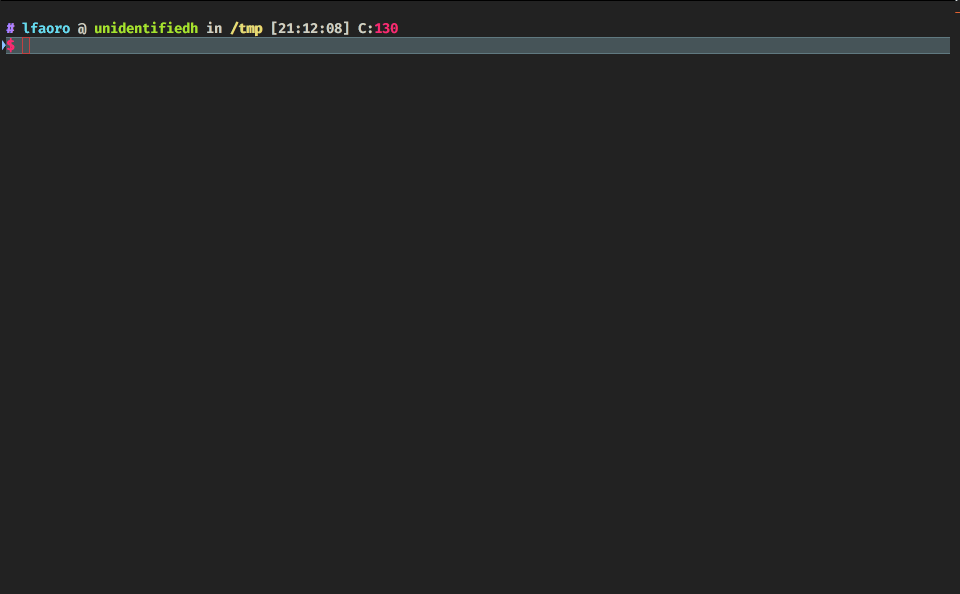

# Flares 🔥

Flares is a CloudFlare DNS backup tool: every time it runs, dumps your DNS table to the screen.

Optionally exports the data into (BIND formatted) zone files.

[](LICENSE) [](https://goreportcard.com/report/github.com/lfaoro/flares)
[](https://app.fossa.io/projects/git%2Bgithub.com%2Flfaoro%2Fflares?ref=badge_shield)



## Quick Start - docker (painless)

```bash
# CloudFlare auth key is here: https://dash.cloudflare.com/profile ->
# Global API Key -> View
$ export CF_API_KEY=abcdef1234567890
$ export CF_API_EMAIL=someone@example.com
$ docker run -it --rm \
-e CF_API_KEY="$CF_API_KEY" \
-e CF_API_EMAIL="$CF_API_EMAIL" \
lfaoro/flares domain1.tld domain2.tld
```

## Quick Start - compile (full control)

Golang must be installed: https://golang.org/dl/

```bash
# flaredns
$ go get -u github.com/lfaoro/flares/cmd/flaredns
$ cd $GOPATH/src/github.com/lfaoro/flares/
# flarelogs (TODO: coming soon)
# $ go get -u github.com/lfaoro/flares/cmd/flarelogs
```

### Set the CF_API_KEY and CF_API_EMAIL

```bash
$ flaredns auth # (TODO: coming soon) opens the dashboard at https://dash.cloudflare.com/profile
$ export CF_API_KEY=abcdef1234567890
$ export CF_API_EMAIL=someone@example.com
```

### Run the app

```bash
$ make install
$ flaredns -h
$ flaredns domain.tld
$ flaredns domain.tld --export /tmp/tables
```

### Run backup with Gitlab-CI

- Copy [.gitlab-ci.yml](.gitlab-ci.yml) inside an empty gitlab project
- Use the [pipeline schedule feature](https://gitlab.com/help/user/project/pipelines/schedules)
- Each task run will store backup as artifacts

# Contributing

> Any help and suggestions are very welcome and appreciated. Start by opening an [issue](https://github.com/lfaoro/flares/issues/new).

- Fork the project
- Create your feature branch `git checkout -b my-new-feature`
- Commit your changes `git commit -am 'Add my feature'`
- Push to the branch `git push origin my-new-feature`
- Create a new pull request against the master branch

## TODO

- [x] use https://github.com/spf13/cobra for the CLI interface
- [x] add `all` keyword to export all the domains available in the account
- [ ] add `auth` command, automatically opens CloudFlare dashboard
- [ ] add the flarelogs command

## License

[](https://app.fossa.io/projects/git%2Bgithub.com%2Flfaoro%2Fflares?ref=badge_large)
